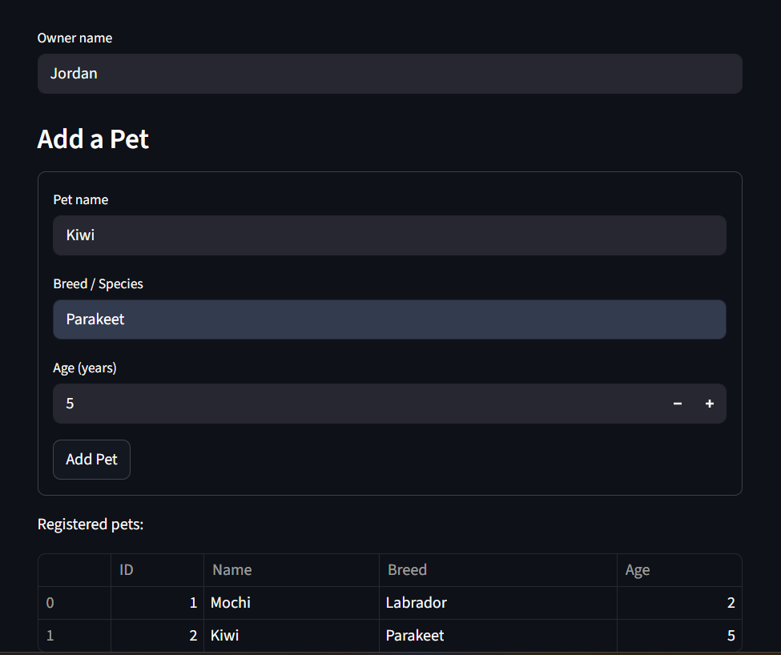
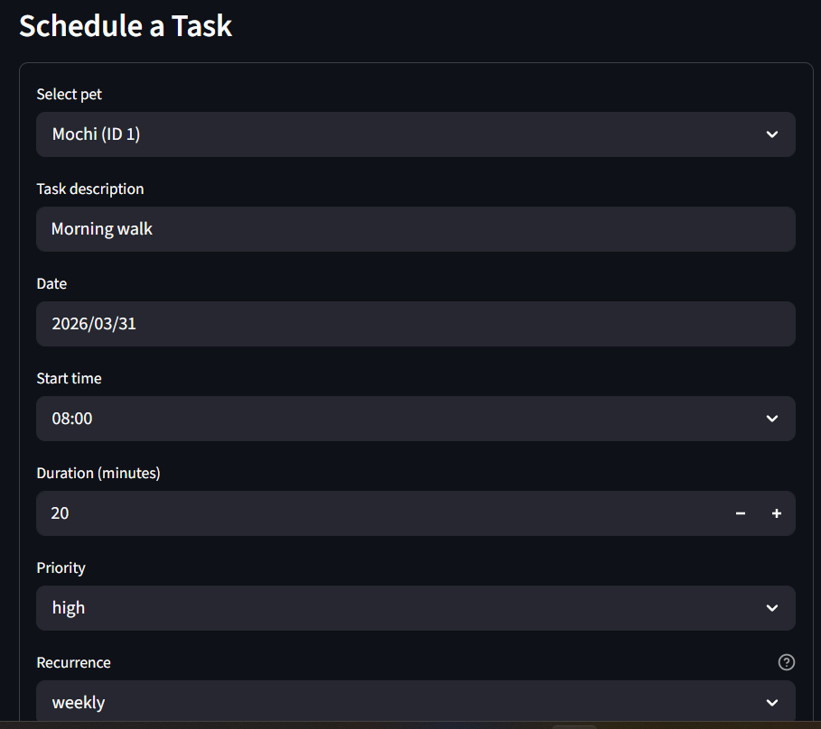
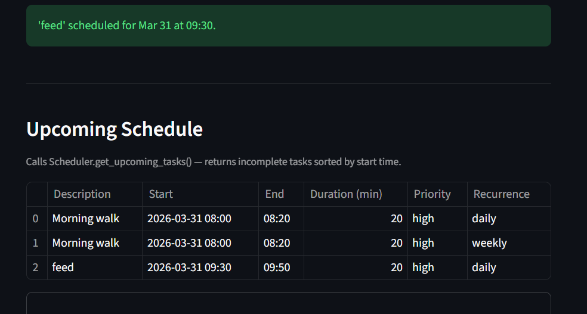
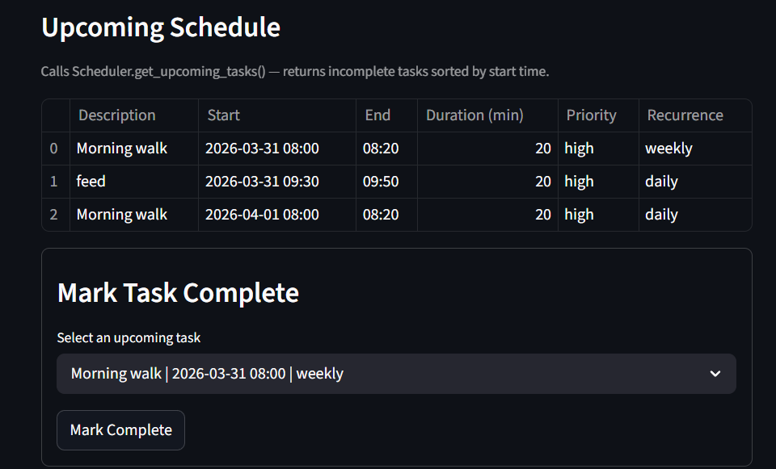

# PawPal+

PawPal+ is a Streamlit-based pet care planning app for managing multiple pets, scheduling tasks, and tracking daily care activities.

## Overview

The system is designed around five core types:

- `Owner`: stores owner profile and owned pets.
- `Pet`: stores pet information and pet-specific tasks.
- `Task`: stores task details such as start time, duration, priority, completion state, and recurrence.
- `Scheduler`: central orchestration layer for sorting, filtering, conflict detection, and recurring task automation.
- `ConflictInfo`: structured conflict warning details returned by conflict detection.

## Features

- Time-based task sorting:
Tasks are ordered chronologically using `start_time` so the upcoming schedule is shown in execution order.

- Multi-condition task filtering:
Tasks can be filtered by completion status (`completed` or `incomplete`) and/or by pet name (case-insensitive).

- Conflict detection with overlap logic:
The scheduler checks overlap using interval comparison (`new_start < existing_end` and `existing_start < new_end`) and returns detailed warning data for each conflict.

- Conflict warnings in the UI:
When a new task overlaps existing tasks, the app surfaces readable warnings that include pet name, task description, and time window.

- Recurring task automation:
Tasks support recurrence values (`once`, `daily`, `weekly`). When a recurring task is marked complete, the scheduler automatically creates the next occurrence with the same details and a shifted start time.

- Mark-complete workflow:
Users can mark scheduled tasks complete directly from the app. This action updates task status and triggers recurrence automation when applicable.

## Getting Started

### Setup

```bash
python -m venv .venv
source .venv/bin/activate  # Windows: .venv\Scripts\activate
pip install -r requirements.txt
```

### Run the App

```bash
streamlit run app.py
```

## Testing

Run tests with:

```bash
python -m pytest
```

Current tests check whether the following functionalities are working properly or not:

- Sorting and filtering behavior
- Recurring-task creation after completion
- Conflict detection across single and multiple pets
- Handling of completed tasks in conflict checks

## Reliability

Confidence level based on current test results: 4.5/5.

## Demo
- Add a new owner, pets
    
- Create tasks for pets
    
- Warning message for time conflict!
    [alt text](image-1.png)
- Show upcoming schedule to the user
    
- Mark Morning walk (daily) as complete. The scheduler moves to the next day.
    